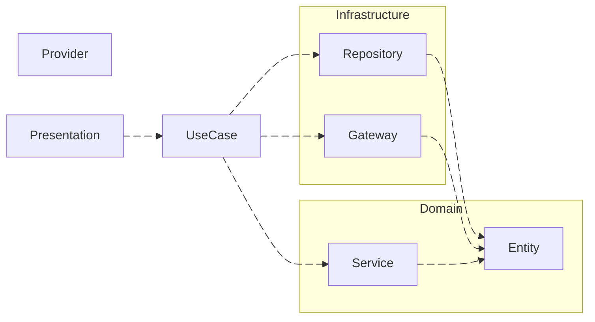

 

| フォルダ     | 説明                                               |
| ------------ | -------------------------------------------------- |
| Provider     | RiverPodを使用したDependency Injection・状態管理   |
| Presentation | WidgetによるUI表示                                 |
| UseCase      | Repository・Gateway・Domain Serviceの処理を実行    |
| Repository   | データ保存処理                                     |
| Gateway      | データ保存以外の外部APIを使用した処理              |
| Domain       | Entity・Value Objectの定義、独自のビジネスロジック |

#### 処理例

1. Presentationでローテーション作成Buttonをクリック
2. UseCaseが実行される
3. Repositoryを使用しローテーション設定をDBに保存
4. Domain Serviceでローテーション設定を元に30日分の通知設定を計算
5. Gatewayで30日分の通知設定を登録

:::caution
実際のUseCaseはInterfaceを経由してRepositoryやGatewayを利用するため正確な図ではないですが、Repository・Gateway・Domain Serviceが処理を `定義` する部分であり、UseCaseがそれらを組み合わせて `実行` する部分であることが分かれば幸いです
:::

:::info
今後はUseCaseに集約している処理をBlocを利用したEvent駆動にすることで、UseCaseの肥大化を解消し、ロジックの並行処理をしやすくしたいと考えています
:::
