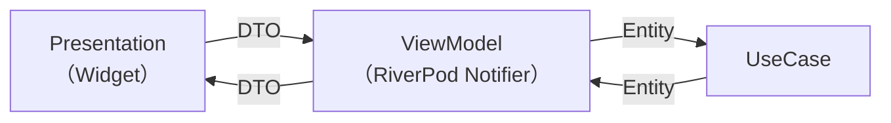

- ViewModel (RiverPod Notifier)
  - DTOが引数、戻り値の関数を定義
- UseCase
  - Entityが引数、戻り値の関数を定義

1. PresentationにおけるWidgetのButtonをClick
2. Request用DTOを作成し、ViewModelのメソッドを呼び出す
3. ViewModelにおいて、DTOをEntityに変換し、UseCaseのメソッドを呼び出す
4. UseCaseでRepositoryやService処理を実行後、EntityをViewModelに返却
5. ViewModelにおいて、EntityをResponse用のDTOに変換し、Presentationに返却
6. PresentationでDTOをもとにUIを再レンダリング

:::info
基本的にはRequestとResponseでDTOを分けます
:::
