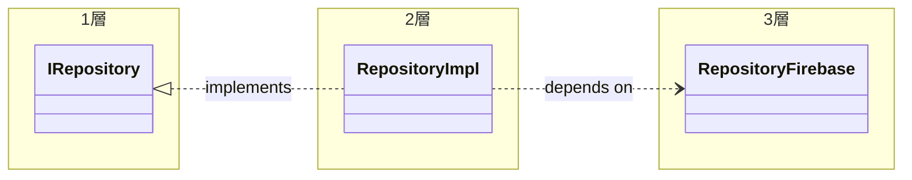
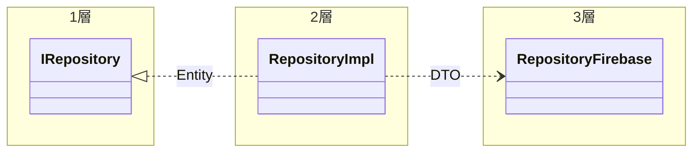

- どちらも外部に依存することは同じであり、コードの実装方法は同じ
- Entityを保存するための外部処理はRepositoryに記載
  - Firebase Firestore
- その他の外部処理はGatewayに記載
  - flutter_local_notifications
- Domainが外部に依存しないように、Interfaceを定義し抽象化

:::caution
実装方法が同じためGatewayについては割愛します
:::

## 3層構造

infrastructureの実装ルール

- `1層` : Interfaceの定義、引数および戻り値はEntityです
- `2層` : Interfaceの実装、Entity と DTOの変換処理をします
  - ViewModel相当です
- `3層` : 実際に外部APIを呼び出す層です。引数および戻り値はDTOです

:::caution
Repositoryは `データの保存` という意味で一般的に利用されますが、`外部APIの呼び出し` についてはGatewayは一般的ではなく、External API等の色々な呼び方がされているようです
:::
