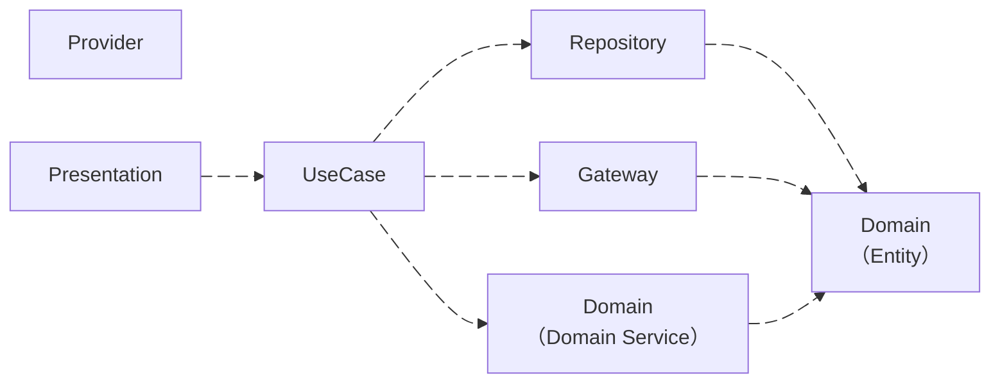
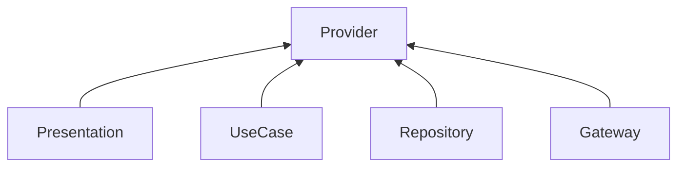
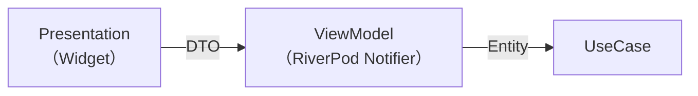

### 全体図

以下6つのフォルダで構成されます



| フォルダ     | 説明                                               |
| ------------ | -------------------------------------------------- |
| Provider     | RiverPodを使用したDependency Injection・状態管理   |
| Presentation | WidgetによるUI表示                                 |
| UseCase      | Repository・Gateway・Domain Serviceの処理を実行    |
| Repository   | データ保存処理                                     |
| Gateway      | データ保存以外の外部APIを使用した処理              |
| Domain       | Entity・Value Objectの定義、独自のビジネスロジック |

#### 処理例

1. Presentationでローテーション作成Buttonをクリック
2. UseCaseが実行される
3. Repositoryを使用しローテーション設定をDBに保存
4. Domain Serviceでローテーション設定を元に30日分の通知設定を計算
5. Gatewayで30日分の通知設定を登録

:::caution
実際はUseCaseでInterfaceを経由してRepositoryやGatewayを利用するため正確な図ではないですが、Repository・Gateway・Domain Serviceが各用途に応じてフォルダ分けしロジックを定義する部分であり、UseCaseがそれらのロジックを組み合わせて実行する部分であることが分かれば幸いです
:::

:::note
今後はUseCaseに集約している処理をBlocを利用したEvent駆動にすることで、UseCaseの肥大化を解消し、ロジックの並行処理をしやすくしたいと考えています
:::

### Provider (RiverPod)


<br/>
RiverPodには様々な機能があり、以下3つの機能に応じてファイル名を分けています<br/>
xxx_notifierは、Redux<br/>
xxx_loaderは、TanStack Queryに近い気がします

| ファイル名    | 機能                                                            |
| ------------- | --------------------------------------------------------------- |
| xxx_providers | Dependency Injection                                            |
| xxx_notifier  | ViewModel （状態管理するClassでありButtonなどをトリガーに実行） |
| xxx_loader    | Future/Streamを戻り値とするデータ取得用Method                   |

:::info
DIは、UseCase・Repository・Gateway・Domain Serviceが対象です。PresentationはDIせず、ref.watchします。理由としては、直接ref.watchすることでFutureやStream、Stateに応じてWidgetを再レンダリング、リアルタイム描画が可能になるからです。
:::

### Presentation と UseCase



## フォルダ構造

1. `fetures` 配下に画面 (機能) ごとにフォルダを区切る

:::info
モバイルアプリケーションはフロントエンドに相当し、画面が中心となるため、画面ごとにフォルダを区切ります
:::

```yaml
features/
├── auth/           # 認証画面
├── calendar/       # カレンダー画面
├── drawer/         # サイドバー
├── home/           # ホーム画面 (ローテーションを一覧表示)
├── notifications/  # ローテーションに基づいた通知設定機能
└── rotation/       # ローテーション作成画面
```

2. xxx

```yaml
rotation/
├── domain/
│   ├── entities/       # ロジック
│   ├── gateways/       # DB等以外の外部API呼び出し (Interface)
│   ├── repositories/   # entityをDB等に保存し永続化 (Interface)
│   ├── services/       # 複数のentityにまたがるロジック
│   ├── value_objects/  # プリミティブ型の代わり
├── infrastructure/
│   ├── dto/
│   ├── repositories/   # 実装
│   └── gateways/       # 実装
├── presentation/
│   ├── dto/
│   ├── screens/        # Scaffoldを返す親Widget
│   └── widgets/        # screensで利用される子Widget
├── providers/          # RiverPod
└── use_cases/          # repository、gateway、serviceを利用した複合処理
```

### entities と services

screenにおけるロジックをentitiesやservicesに移動させられるかが課題になっています。if文やListのメソッドの使用に注意を払うよう気を付けます

### repositories と gateway

- どちらも外部に依存することは同じであり、コードの実装は似ています
- entityを保存する処理はrepositoriesに記載し、その他の処理はgatewayに記載するようにしているだけです
- 外部に依存しないように、Interfaceを定義し抽象化します

### value object

Stringやint等のプリミティブ型を使用せず、独自に定義したクラスを型として扱い、以下のメリットを得ます

- バリデーションの実装
- 引数指定ミスのバグ防止

### dto

entityはinfrastructure層やpresentation層で直接利用しません。ビジネスロジックの流出を防ぎ、疎結合にするためです。ビジネスロジックの結果をdtoに含め、repository層やpresentation層で受け取ることで保存や表示を行います

:::info
本アプリはBackendが存在しなくFrontendにビジネスロジックを記載しているため、実施的にビジネスロジックは流出しています...
:::

### use case (application service)

ドメインイベントを用いたマイクロサービスアーキテクチャにする予定

## 命名規則

- フォルダ名は複数形で、ファイル名は単数形
- ファイル名とクラス名は合わせる
- 実装方式を含む場合は末尾に付ける（_firebase, _local, _impl）

### Domain Layer
```yaml
domain/
├── entities/
│   └── {entity_name}.dart                    # rotation_group.dart
├── repositories/
│   └── {entity_name}_repository.dart         # rotation_repository.dart
├── services/
│   └── {service_name}_service.dart           # rotation_calculation_service.dart
│   └── {service_name}_service_impl.dart      # rotation_calculation_service_impl.dart
├── value_objects/
│   └── {value_object_name}.dart              # email.dart, user_id.dart
├── enums/
│   └── {enum_name}.dart                      # weekday.dart
└── gateways/
    └── {gateway_name}_gateway.dart           # notification_gateway.dart
```

### Infrastructure Layer

```yaml
infrastructure/
├── dto/
│   └── {entity_name}_{source}_response.dart     # rotation_group_firebase_response.dart
│   └── {entity_name}_{source}_request.dart      # notification_local_request.dart
├── repositories/
│   └── {entity_name}_repository_{impl_type}.dart    # rotation_repository_firebase.dart
│   └── {entity_name}_repository_impl.dart           # rotation_repository_impl.dart
└── gateways/
    └── {gateway_name}_gateway_{impl_type}.dart      # notification_gateway_local.dart
    └── {gateway_name}_gateway_impl.dart             # notification_gateway_impl.dart
```

### Presentation Layer

```yaml
presentation/
├── dto/
│   └── {action}_{entity_name}_request.dart      # create_rotation_group_request.dart
│   └── {entity_name}_response.dart              # rotation_group_response.dart
├── screens/
│   └── {feature_name}_screen.dart               # rotation_screen.dart, login_screen.dart
├── widgets/
│   └── glass_{widget_purpose}.dart              # glass_form_list.dart, glass_button.dart
│   └── {feature}_{widget_purpose}.dart          # rotation_form_weekday.dart
└── enums/
    └── {enum_name}.dart                         # auth_mode.dart, login_form_key.dart
```

### Use Cases

```yaml
use_cases/
└── {action}_{entity_name}_use_case.dart    # create_rotation_group_use_case.dart
└── {process_name}_use_case.dart            # sync_notifications_use_case.dart
```

### Providers

```yaml
providers/
├── {feature_name}_providers.dart           # rotation_providers.dart (DI用)
├── {feature_name}_controller.dart          # rotation_controller.dart (ViewModel)
├── {feature_name}_state.dart              # rotation_state.dart (Stream変換)
└── {feature_name}_data.dart               # rotation_data.dart (複合データ取得)
```

riverpod provider
dto

## 3層構造

infrastructureの実装ルール

- `1層` : Interfaceを定義、引数および戻り値はEntityにします
- `2層` : 実装、実装のため引数および戻り値はEntityです。3層を呼び出すため、Entity と Dtoの変換処理を担当します
- `3層` : 実際に外部APIを呼び出す層です。引数および戻り値はDtoにします
