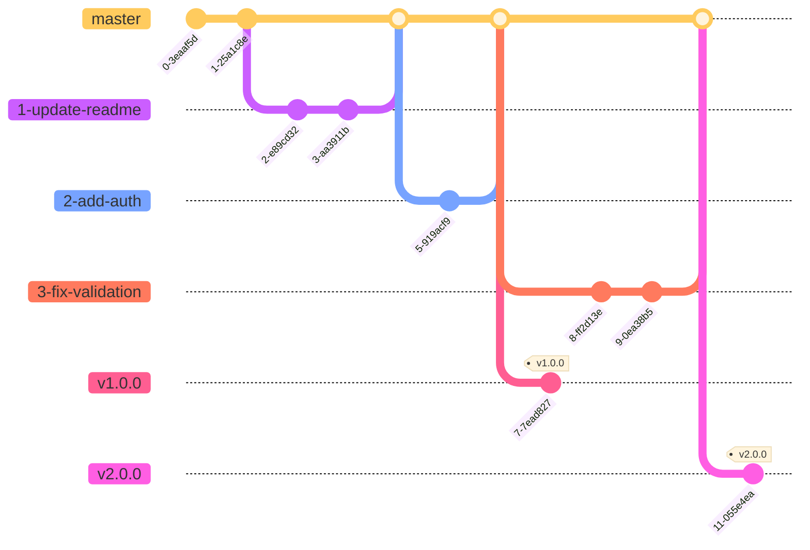

## 3種類のブランチ

| ブランチ名 (例) | 説明                                 |
| --------------- | ------------------------------------ |
| 1-update-readme | 各issue番号に対応する開発用ブランチ  |
| master          | 各issueブランチをマージするブランチ  |
| v1.0.0          | masterから派生するリリース用ブランチ |

## 開発手順

1. issueを作成し、開発内容を記載する
2. masterブランチから、issueに紐づいたissueブランチを作成する
3. issueブランチで開発を行う
4. 開発完了後、masterブランチに対してプルリクエストを作成する
5. リリースするタイミングでreleaseブランチを切る

## コミットルール

以下のようにイシュー番号をつけておくとよい

```
#10 update README.md
```

## プルリクエスト ルール

- タイトルに `closes #issue番号` を記載し、マージ時にissueを自動クローズさせる
- スカッシュマージを使用する
- issueブランチはマージ後に削除する
- releaseブランチは削除しない

## リリース手順

1. masterブランチからreleaseブランチを作成する
2. releaseブランチの作成をトリガーにGitHub Actions・CodemagicでGoogle Playにデプロイする
