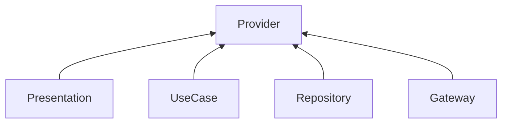

 

- RiverPodには様々な機能があり、以下3つの機能に応じてファイル名を分けています
- xxx_notifierは、Redux
- xxx_handlersは、TanStack Queryに近い気がします

| ファイル名    | 機能                          |
| ------------- | ----------------------------- |
| xxx_providers | Dependency Injection用        |
| xxx_notifier  | 状態管理するClass (ViewModel) |
| xxx_handlers  | 状態管理しないMethod          |

:::info
DIは、UseCase・Repository・Gateway・Domain Serviceが対象です PresentationはDIせず、ref.watchします 理由としては、直接ref.watchすることでFutureやStream、Stateに応じてWidgetを再レンダリングし、リアルタイム描画が可能になるからです。
:::

### Class (ViewModel)

- 戻り値のないMethodを定義
  - 代わりにstateを扱う
    - UIはstateの値に基づいて再レンダリング
    - AsyncValue.guardでローディング状態管理
- .isLoading
  - 処理中のUI変更
- ref.listen
  - 非同期処理完了後に関数を実行
    - Scaffold MessengerやDialogを表示
- 

### Method

- 戻り値 (Future/Stream) があるMethodを定義
  - .whenで初期レンダリング
    - FutureBuilderやStreamBuilderの代わり
  - ref.refreshで値を再取得
  - 取得した結果に基づいて、Scaffold MessengerやDialogを表示

### 共通

- DTOとEntityの変換
  - Presentationからの呼び出され、UseCaseを呼び出す
  - UseCaseからの戻り値をstateに設定 or 関数の戻り値とし、Presentationに返却