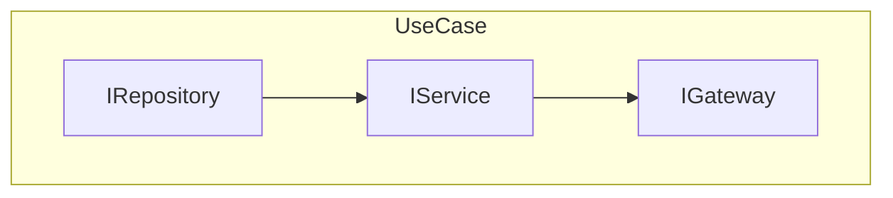
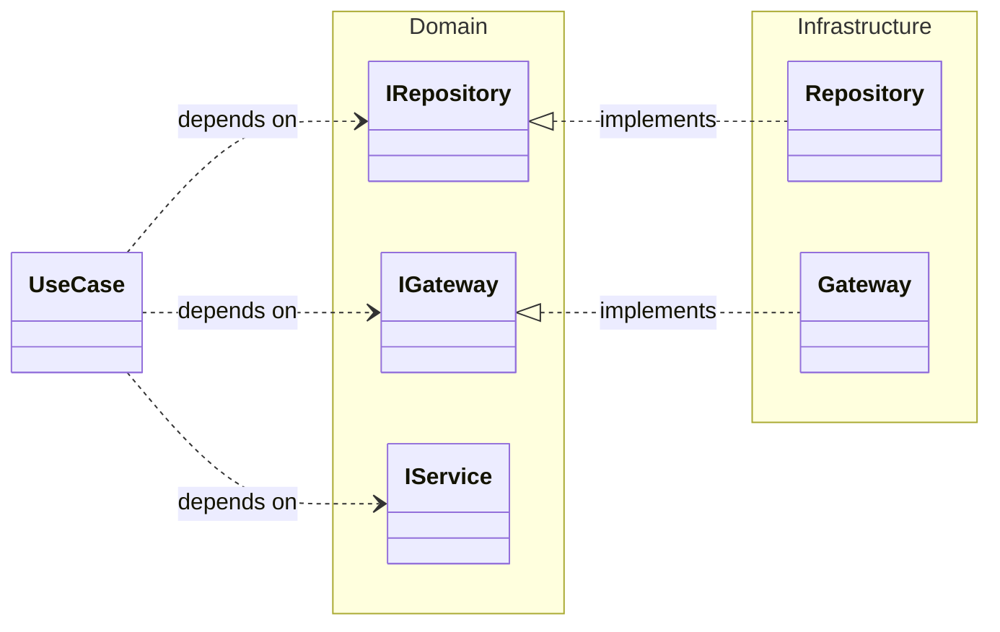

- DomainやInfrastructureで定義した処理を順に実行

1. Repository
   - ローテーション情報をDBに保存
2. Service
   - ローテーション情報をもとに30日分の通知設定を計算
3. Gateway
   - 30日分の通知設定をスマホに登録

:::info
スマホに登録可能な通知設定には限りがあるため、直近30日分のみ登録するような仕組みにしています
:::

:::info
実際は UseCase (Presentation) が Infrastructure に依存しないように Inferface を定義し、Interface に依存しています 全ての依存先は Domain です
:::

